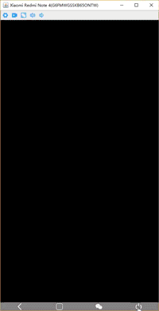

# CXTouch

This is an open source software which control and manage android device from PC client. This software is written in Java, so it can run on Windows, Linux and MacOS where a jre is installed (support Java 6 and later). 

You can use CXTouch for gaming, watching movie, explore app, working on mobile, and all operation supported on device, but more convenient than doing them on device without root.

CXTouch support at least 4 devices running on a pc simultaneously, the supported amount of devices depends on your actual pc performance.



## Features

- OS support
  - Desktop Client: support Windows, Linux, MacOS where a jre is installed.
  - Android: support version 4.4(SDK level 19) to 9.0(SDK Level 28)
- Control any device by mouse and keyboard
  - Real-time screen projection
    - The refresh speed depends on Android version and device performance.
    - Support rotation sensed by CXTouch automatically.
  - Support typing text from pc keyboard.
  - Supports meta keys
  - Copy string content on device and paste string content on pc to editor on device. 
- Take a screenshot.
- Record screen of device.
- Setting for quality and size of  image  
- Support two language: English and Chinese.


## Requirements

- [Java](https://www.oracle.com/technetwork/java/javase/downloads/index.html) 6 and later.
- Make sure you enabled adb debugging on your device(s). 
- A addtional option should be open on some devices such as xiaomi
  - USB debugging (Security settings)
- A [ADB driver](https://adb.clockworkmod.com/) is need if your os is Windows.


## screenshots

[View](doc/screenshot.md)

## Latest Release

- Window
  - [cxtouch-win-1_0.zip](https://github.com/cxplan/CXTouch/releases/download/1.0/CXTouch-win-1_0.zip)
  - cxtouch-win-jre-1_0.zip (Waiting)
- MacOS
  - cxtouch-macos-1_0.zip (Waiting)
- Linux
  - cxtouch-linux-1_0.zip (Waiting)


## Build

The project is managed by maven, so you need to install [maven](http://maven.apache.org/download.cgi) before building project.

Go to the root path of project, and run command below: 

```shell
mvn clean package -DskipTests=true
```

Then a built package will be generated in the folder ${project root}/main/target/CXTouch-*.zip


## Run in workspace

If you open the project using IDE, the work directory should be set: ${project root}/main, not ${project root}


## Contributing

Any contributions that make sense and respect the agreement of project are accepted forever, if you have some good advice, please tell me by information below:

Mail:  liuxiaolin425@163.com


## License

```
                   GNU GENERAL PUBLIC LICENSE
                     Version 3, 29 June 2007

 Copyright (C) 2007 Free Software Foundation, Inc. <https://fsf.org/>
 Everyone is permitted to copy and distribute verbatim copies
 of this license document, but changing it is not allowed.
```

